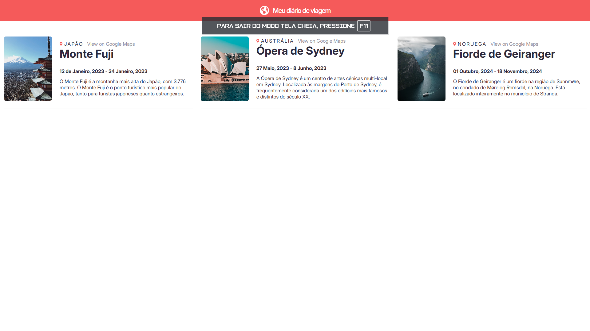
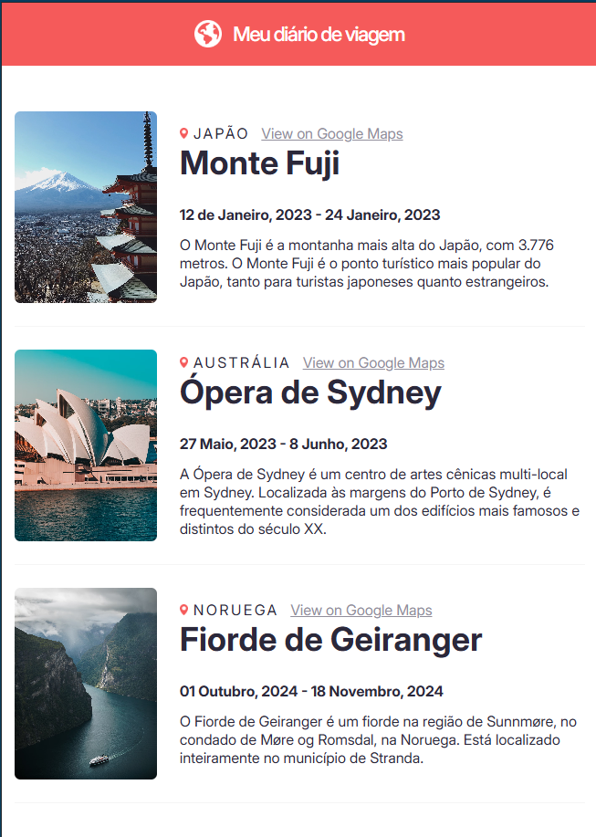

<h1>Meu diário de viagens - versão puro Javascript</h1>

Este projeto consiste em um diário de viagem que cria artigos de acordo com a quantidade de objetos no arquito <code>database</code> utilizando apenas HTML, CSS e Javascript puro, ou seja, sem nenhuma biblioteca ou framework.

<h2>Objetivo</h2>

O objetivo deste projeto é criar uma versão de outro projeto que fiz sem usar a biblioteca React.

Ao fazer uma versão sem o uso do React, consigo colocar em prática apenas os recursos disponibilizado pela linguagem Javascript

O foco, portanto, é ver a diferença ao utilizar a biblioteca React na criação de sites, vendo na prática a sua praticidade no desenvolvimento web.

<h2>Como funciona?</h2>
<ul>
    <li>
A criação dos artigos é feita através de uma classe chamada <code>Entries</code>;
</li>
    <li>
A classe possui atributos que correspondem a cada elemento HTML utilizados para criar um artigo;
</li>
    <li>
É feito uma iteração em todos os objetos importados do arquivo <code>database</code>, onde é criado um artigo para cada objeto retornado.
</li>
</ul>

Dessa forma, sempre que um novo dado é adicionado à "base de dados", um novo artigo é criado automáticamente.

<h2>Site no computador</h2>
 
<h2>Site no celular</h2>
 